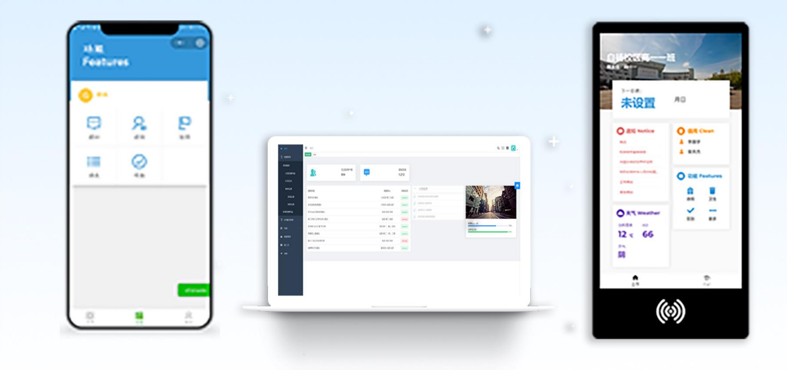
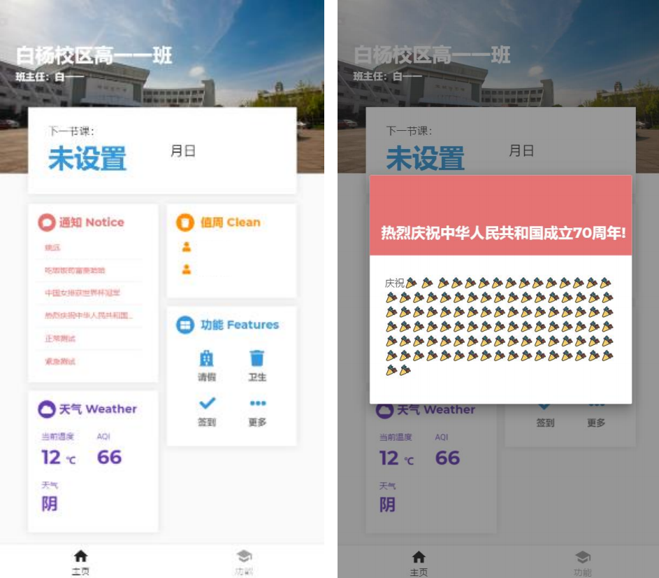
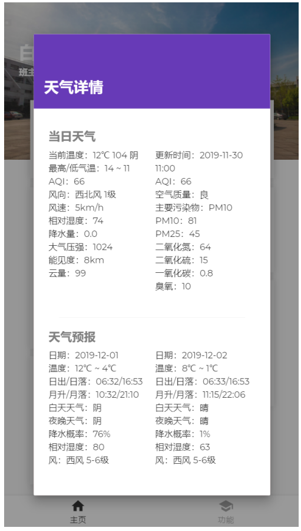
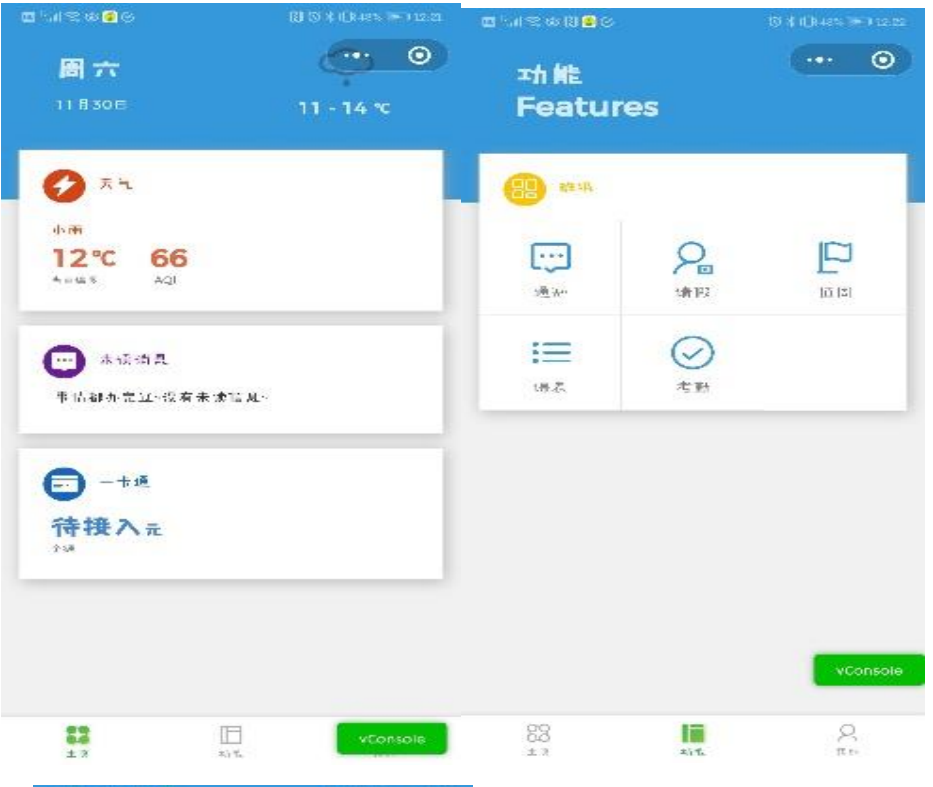
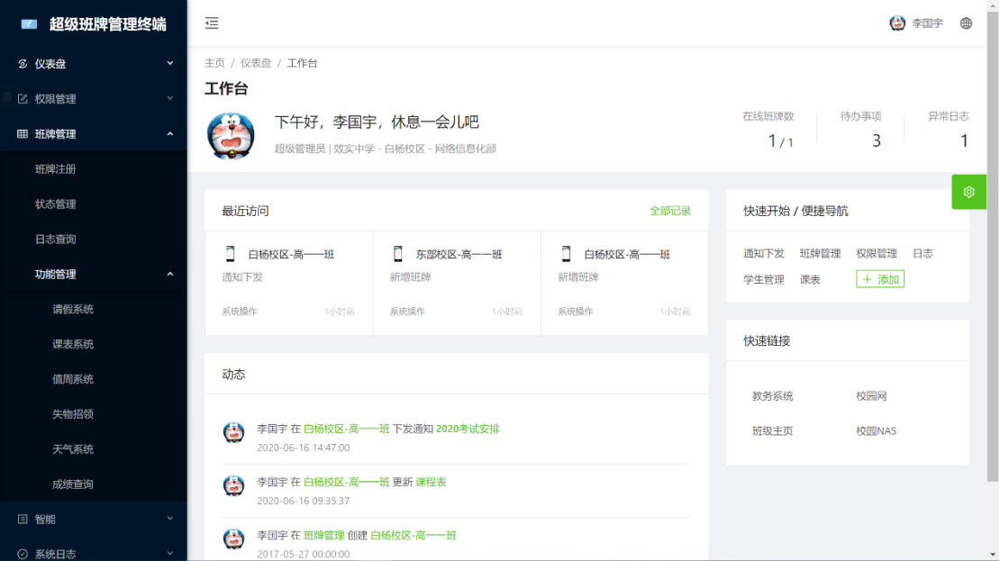

# Super-Eboard

## Intro
- 一款开源的电子班牌应用，目的在于解决中小学因学生不能携带手机导致的通知不及时的现象，致力于实现数字校园应用。
- 采用全Web开发，可以运行在成本很低的嵌入式芯片上。
- 采用模块化开发理念，您可以很方便的添加您的功能。
- 目前支持特性：班级管理、通知发送、请假、人脸识别/校园卡登录、课表、天气、时间、签到等。

**部分源代码涉及安全，保留，有需要请提Issue**
**欢迎提出feature请求！**
## Screenshots





## Setup
### Project setup
```
npm install
```

### Compiles and hot-reloads for development
```
npm run serve
```

### Compiles and minifies for production
```
npm run build
```

### Run your tests
```
npm run test
```

### Lints and fixes files
```
npm run lint
```